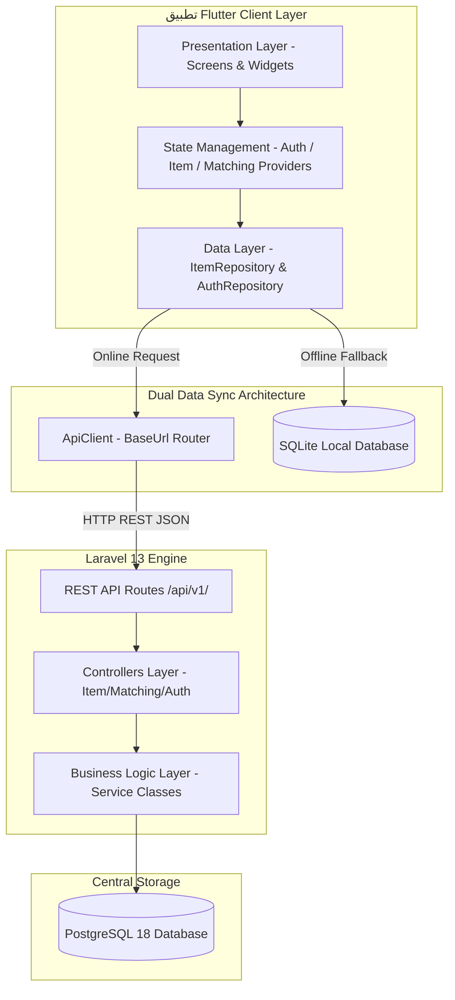
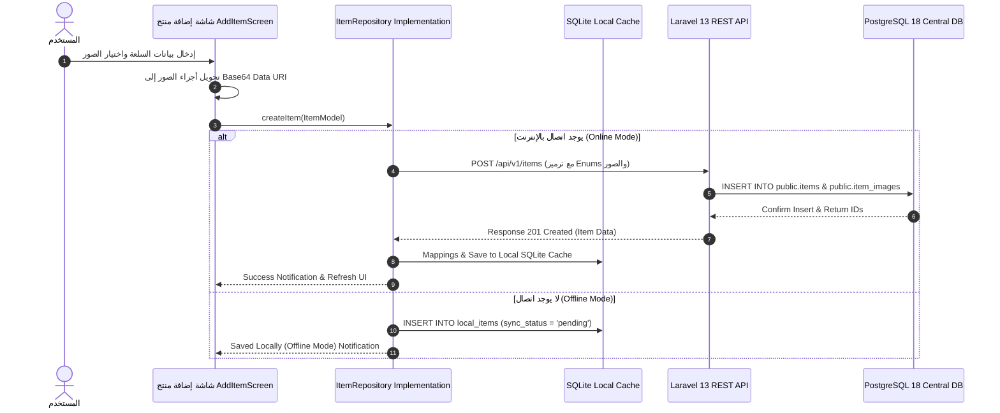
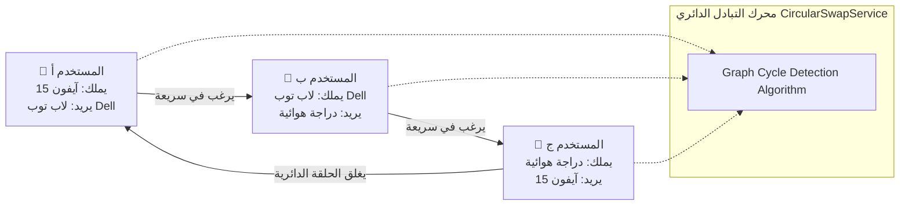
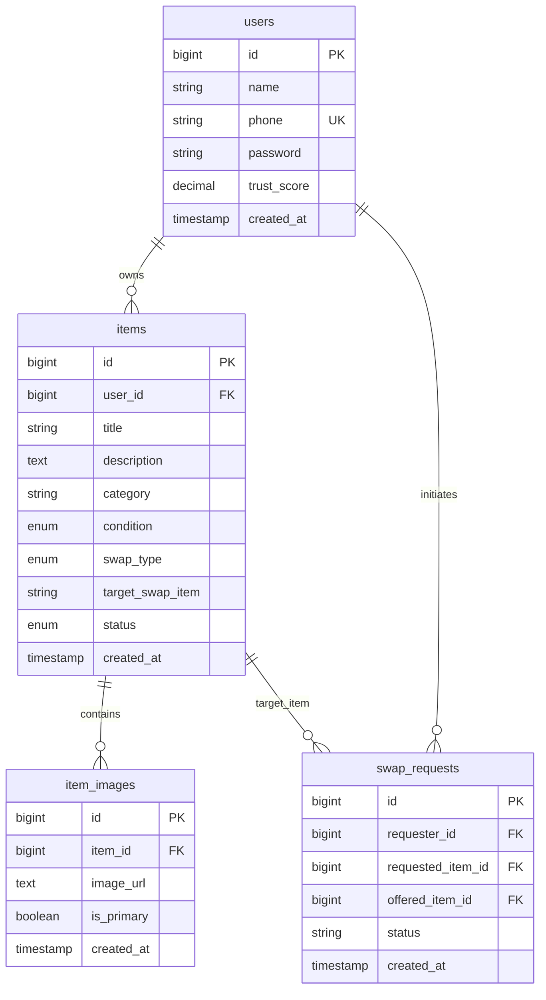
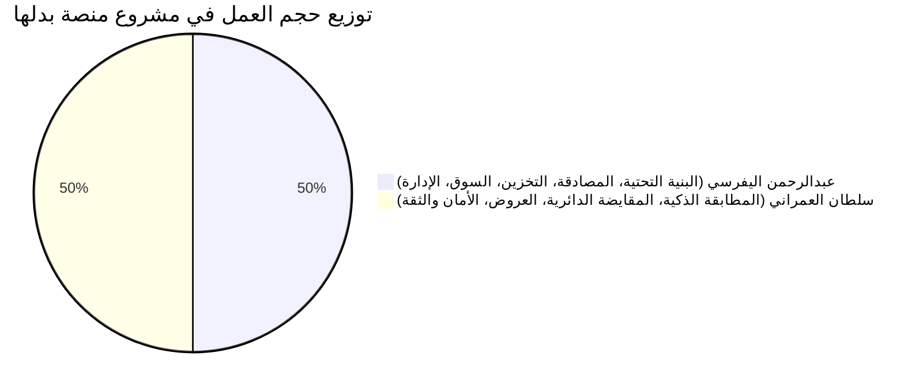

# 📘 المرجع الهندسي والتوثيق الشامل لمشروع منصة بَدِّلْهَا (BADELHA APP)

---

## 📑 فهرس المحتويات
1. [الفكرة العامة والمشكلة والحل والهدف](#1-الفكرة-العامة-والمشكلة-والحل-والهدف)
2. [المميزات الرئيسية وحزمة التقنيات (Tech Stack)](#2-المميزات-الرئيسية-وحزمة-التقنيات-tech-stack)
3. [خارطة التدفق الكاملة وخارطة العمليات (Flowcharts & Process Maps)](#3-خارطة-التدفق-الكاملة-وخارطة-العمليات)
4. [مبادئ هندسة البرمجيات ومعمارية النظام (Software Engineering & Clean Architecture)](#4-مبادئ-هندسة-البرمجيات-ومعمارية-النظام)
5. [مبادئ وأنشطة Laravel 13 المطبقة (Laravel 13 Architecture & SOLID)](#5-مبادئ-وأنشطة-laravel-13-المطبقة)
6. [هيكل ملفات ومكعبات المشروع (Directory Tree & Code Structure)](#6-هيكل-ملفات-ومكعبات-المشروع)
7. [قواعد البيانات والجداول بالتفصيل (PostgreSQL 18 & SQLite Schema)](#7-قواعد-البيانات-والجداول-بالتفصيل)
8. [آلية العمل الهجين (Offline / Online Hybrid Sync Algorithm)](#8-آلية-العمل-الهجين-offline--online-hybrid-sync-algorithm)
9. [وصف واجهات المستخدم بدقة تفصيلية عالية (UI/UX Detailed Specs)](#9-وصف-واجهات-المستخدم-بدقة-تفصيلية-عالية)
10. [آلية الربط المزدوج (Flutter ↔ API ↔ PostgreSQL ↔ SQLite)](#10-آلية-الربط-المزدوج)
11. [دليل ومعمارية الـ RESTful API بالتفصيل](#11-دليل-ومعمارية-الـ-restful-api-بالتفصيل)
12. [دورة العمليات الكاملة للتطبيق (End-to-End Operation Lifecycles)](#12-دورة-العمليات-الكاملة-للتطبيق)
13. [توزيع المسؤوليات العادل بين أعضاء الفريق (50% / 50%)](#13-توزيع-المسؤوليات-العادل-بين-أعضاء-الفريق)

---

## 1. الفكرة العامة والمشكلة والحل والهدف

### 💡 1.1 فكرة المشروع (Concept)
منصة **بَدِّلْهَا (BADELHA)** هي تطبيق مقايضة ذكي وتبادل مباشر ودائري للسلع والخدمات بدون الحاجة للتعامل المالي المباشر، وتعتمد المنصة على الذكاء الاصطناعي وخوارزميات المطابقة الرياضية لتسهيل تبادل الأغراض الشخصية، الإلكترونيات، الأثاث، والسيارات بين المستخدمين المحليين.

### 🔴 1.2 المشكلة (Problem Statement)
1. **صعوبة التخلص من الأغراض المستعملة بقيمتها العادلة:** يواجه المستخدمون هبوطاً كبيراً في أسعار السلع المستعملة عند محاولة بيعها نلداً.
2. **انعدام المطابقة المباشرة بين شخصين (The Double Coincidence of Wants):** قد يملك "علي" هاتفاً ويفضل الحصول على "لاب توب"، بينما يملك "أحمد" "لاب توب" ولكنه يريد "ساعة ذكية"، مما يعطل عملية المقايضة التقليدية المباشرة.
3. **ضعف الثقة والمخاطر الأمنية:** خوف المستخدمين من الاحتيال أو تلقي منتجات تالفة عند التبادل المباشر.
4. **انقطاع الاتصال بالإنترنت:** توقف معظم تطبيقات التجارة الإلكترونية عن العمل تماماً في حال ضعف أو انقطاع الشبكة.

### 🎯 1.3 الحل المبتكر (Proposed Solution)
* **محرك المقايضة الدائرية (Circular Multi-Way Swap Engine):** يحل عقدة المطابقة المباشرة عبر إنشاء حلقة تبادل ثلاثية أو متعددة الأطراف `(المستخدم أ ➔ المستخدم ب ➔ المستخدم ج ➔ المستخدم أ)` لضمان حصول كل طرف على بغيته.
* **المطابقة الذكية (Smart Matching Engine):** مطابقة رغبة المستخدم السلوكية مع المنتجات المعروضة في المنصة واحتساب نسبة التوافق المئوية `% Match Score`.
* **مستوى الأمان والثقة (Trust Score System):** نظام تقييم ديناميكي يضمن موثوقية الطرف الآخر وحماية المقايضة عبر اتفاقية ضمان سلامة التبادل (`Swap Safety Dialog`).
* **المعمارية الهجينة (Hybrid Offline-First Sync):** إمكانية تصفح، إضافة، وحفظ المنتجات محلياً في **SQLite** أثناء انقطاع الشبكة، مع المزامنة التلقائية الفورية مع **PostgreSQL 18** عبر **Laravel 13 REST API** عند توفر الاتصال.

---

## 2. المميزات الرئيسية وحزمة التقنيات (Tech Stack)

### 🌟 2.1 المميزات الرئيسية (Core Features)
1. **تغذية السوق المباشر (Marketplace Feed):** شبكة استعراض مرنة من عمودين ببطاقات تفاعلية أنيقة وتحديث حي لقائمة السلع.
2. **التنقل باللمس والسحب (Touch Swipeable Navigation):** إمكانية الفرك والسحب لليمين واليسار بين الشاشات السفلية عبر `PageView` و `PageController`.
3. **رفع المنتجات الهجين والتشفير المباشر:** رفع الصور وتشفيرها لـ `Base64 Data URI` لتخزينها الفوري في PostgreSQL 18 واسترجاعها بسهولة على أي منصة.
4. **محرك المقايضة الذكية والدائرية:** اقتراح أفضل الخيارات المتوافقة وحلول حلقات المقايضة الثلاثية.
5. **إدارة العروض والمفاوضات:** تقديم، قبول، أو رفض عروض المقايضة المباشرة.

### 🛠️ 2.2 حزمة التقنيات (Technology Stack)

| الطبقة (Layer) | التقنية المستخدمة (Technology) | الإصدار (Version) | الغرض والاستخدام |
| :--- | :--- | :--- | :--- |
| **Frontend UI** | Flutter & Dart | 3.27+ / Dart 3.6+ | إطار عمل الواجهات وتطبيق الهاتف والمكتب |
| **Architecture** | Clean Architecture + Provider | Latest | فصل الطبقات (Domain, Data, Presentation) |
| **Backend Framework**| Laravel Framework | **Laravel 13** | طبقة الأعمال، الأمان، وإدارة واجهات API |
| **Primary Database** | PostgreSQL | **PostgreSQL 18** | قاعدة البيانات المركزية ومصدر الحقيقة المركزي |
| **Local Offline DB** | SQLite | 3.x | التخزين المحلي المؤقت لحالات عدم الاتصال |
| **HTTP Client** | Dio & Http Client | Latest | إدارة طلبات API ورؤوس الأمان والتشفير |
| **Authentication** | Laravel Sanctum / Token Auth | Latest | مصادقة وتأمين جلسات المستخدمين |

---

## 3. خارطة التدفق الكاملة وخارطة العمليات

### 🔄 3.1 مخطط تدفق معمارية النظام (System Architecture Diagram)



---

### ⚙️ 3.2 خارطة دورة عمليات إضافة وحفظ السلع والصور (Add Item Sequence)



---

### 🔁 3.3 خارطة عمليات المقايضة الدائرية الثلاثية (Circular Swap Flow)



---

## 4. مبادئ هندسة البرمجيات ومعمارية النظام

تم بناء المشروع بالكامل بناءً على أفضل مبادئ هندسة البرمجيات المعاصرة (**Software Engineering Best Practices**):

### 🧱 4.1 معمارية النطاق النظيف (Clean Architecture)
ينقسم كود Flutter إلى ثلاث طبقات رئيسية منفصلة تماماً (Decoupled Layers):

```text
lib/
├── domain/                  <-- طبقة النطاق والقواعد الأساسية (Entities & Repository Interfaces)
├── data/                    <-- طبقة البيانات وممصادر البيانات (Models, Repositories Impl, API Services)
└── presentation/            <-- طبقة الواجهات وإدارة الحالة (Screens, Widgets, Providers)
```

1. **طبقة العرض (Presentation Layer):** تحتوي على الشاشات والـ Widgets وإدارة الحالة باستخدام `Provider` أو `ChangeNotifier`. لا تحتوي هذه الطبقة على أي منطق استعلامات قواعد بيانات أو شبكة.
2. **طبقة البيانات (Data Layer):** تحتوي على الـ `Models` المحولة من وإلى JSON، وتحتوي على تطبيق الـ Repositories ومصادر البيانات الشبكية والمحلية.
3. **طبقة النطاق (Domain Layer):** تحتوي على الكيانات النظيفة والعقود (`Interfaces`) التي تضمن عدم اعتماد المنطق التجاري على الإطارات الخارجية (Framework Agnostic).

### 📐 4.2 مبادئ SOLID الخمسة المطبقة
1. **Single Responsibility Principle (SRP):** كل كلاس مسؤول عن وظيفة واحدة فقط. على سبيل المثال، `MatchingService` مسؤول حصرياً عن حساب المطابقة، بينما `ItemService` مسؤول عن عمليات السلع.
2. **Open/Closed Principle (OCP):** النظام مفتوح للتوسع ومغلق للتعديل عبر استخدام Interfaces ومستودعات مجردة (`ItemRepository`).
3. **Liskov Substitution Principle (LSP):** يمكن استبدال المصادر المحلية بالمصادر السحابية دون كسر عمل الـ Repositories.
4. **Interface Segregation Principle (ISP):** عدم إجبار الكلاسات على استهلاك واجهات برمجة لا تحتاجها.
5. **Dependency Inversion Principle (DIP):** اعتماد الطبقات العليا على التجريدات (`Abstract Classes`) وليس على التطبيقات التفصيلية.

---

## 5. مبادئ وأنشطة Laravel 13 المطبقة

تم بناء الخلفية البرمجية للمشروع باستخدام **Laravel 13** واتباع أعلى المعايير المعمارية:

### ⚙️ 5.1 فصل الطبقات واستخدام Service Layer Pattern
عدم كتابة أي منطق تجاري داخل الـ Controllers، بل توجيه جميع العمليات المعقدة إلى **Service Classes**:
- **`AuthService.php`**: إدارة المصادقة، التشفير، وإصدار توكنات Sanctum.
- **`ItemService.php`**: إدارة إضافة وتعديل السلع وحفظ الصور في `public.item_images`.
- **`MatchingService.php`**: خوارزمية حساب التوافق المئوي بين المنتجات المعروضة والمطلوبة.
- **`CircularSwapService.php`**: كشف حلقات المقايضة الثلاثية (Graph Cycle Detection).
- **`TrustService.php`**: حساب درجات الثقة وسجل التقييمات ⭐.

### 🛡️ 5.2 طلبات النماذج والأمان (Form Requests & Validation)
استخدام `FormRequest` مخصص لكل عملية فحص وتدقيق البيانات قبل وصولها للـ Controller:
- التحقق من نوع الصورة وأبعادها وحجم الـ Base64.
- فحص القيم المدخلة ومطابقتها مع قائمة الـ Enums المعتمدة في PostgreSQL.

### 📦 5.3 تحويل المخرجات عبر API Resources
استخدام `JsonResource` لتشكيل وتوحيد شكل الاستجابات الحارجة من الـ API لضمان بقاء الحقول متناسقة مائة بالمائة مع نماذج Flutter (`ItemModel.fromJson`).

---

## 6. هيكل ملفات ومكعبات المشروع

```text
badelha_app/
├── android/                        <-- إعدادات وتكفيج منصة أندرويد
├── ios/                            <-- إعدادات منصة iOS
├── web/                            <-- إعدادات وتكفيج تطبيق الويب
├── windows/                        <-- إعدادات وتكفيج تطبيق ويندوز المكتبي
├── assets/                         <-- الصور والأيقونات والأصول ثابتة
│   ├── icons/
│   └── images/
├── backend/                        <-- مشروع Laravel 13 Backend
│   ├── app/
│   │   ├── Http/
│   │   │   ├── Controllers/Api/   <-- API Controllers (Item, Auth, Swap, Matching)
│   │   │   └── Requests/          <-- Form Validation Requests
│   │   ├── Models/                <-- Eloquent Models (Item, ItemImage, User, Swap)
│   │   └── Services/              <-- Business Logic Service Layer
│   ├── config/                    <-- إعدادات Laravel والقواعد
│   ├── database/
│   │   ├── migrations/            <-- هجرات جداول PostgreSQL 18
│   │   └── seeders/               <-- البيانات الأولية والتجريبية
│   └── routes/
│       └── api.php                <-- مسارات واجهات API v1
├── lib/                            <-- كود تطبيق Flutter الرئيسي
│   ├── data/
│   │   ├── models/                <-- نماذج تحويل البيانات JSON models
│   │   ├── repositories/          <-- تطبيق مستودعات البيانات
│   │   └── services/              <-- ApiClient & SQLite Database Helper
│   ├── presentation/
│   │   ├── providers/             <-- مزودات الحالة (State Management)
│   │   ├── screens/               <-- شاشات التطبيق الأساسية
│   │   │   ├── add_item/
│   │   │   ├── admin/
│   │   │   ├── auth/
│   │   │   ├── circular_swap/
│   │   │   ├── explore/
│   │   │   ├── item_details/
│   │   │   ├── marketplace/
│   │   │   ├── matching/
│   │   │   ├── merchant/
│   │   │   ├── offers/
│   │   │   ├── profile/
│   │   │   └── shell/
│   │   └── widgets/               <-- العناصر البرمجية وإعادة الاستخدام (ItemCard, ImageWidget, etc.)
├── team_packages/                  <-- حزم وأدلة عمل فريق التطوير (عبدالرحمن وسلطان)
│   ├── abdurahman_alyafarsi/
│   ├── sultan_alamrani/
│   └── EQUALLY_BALANCED_WORKLOAD.md
├── pubspec.yaml                    <-- مكتبات واشتراطات مشروع Flutter
├── USER_GUIDE_AR.md               <-- دليل التصفح والواجهات الشامل
└── README.md                       <-- وثيقة المستودع الأساسية
```

---

## 7. قواعد البيانات والجداول بالتفصيل

يعتمد المشروع على نظام قواعد بيانات محكم ومتطور:

### 🗄️ 7.1 قاعدة البيانات المركزية: PostgreSQL 18
تتكون قاعدة البيانات من الجداول الرئيسية التالية في مخطط `public`:



#### 📊 تفاصيل جداول PostgreSQL 18 الرئيسية:
1. **جدول المستخدمين (`public.users`):**
   - `id`: المعرف الرئيسي تلقائي الزيادة.
   - `phone`: رقم الهاتف (فريد - يُستخدم لتدقيق تسجيل الدخول).
   - `trust_score`: درجة الأمان والثقة ⭐ للمستخدم (من 0.0 إلى 5.0).

2. **جدول المنتجات والسلع (`public.items`):**
   - `id`: المعرف الفريد للسلعة.
   - `user_id`: المفتاح الأجنبي المرتبط بصاحب السلعة.
   - `condition`: enum مخصص في PostgreSQL يقبل القيم الحصرية (`new`, `like_new`, `excellent`, `good`, `fair`).
   - `swap_type`: enum مخصص يقبل (`exact_match`, `cash_adjustment`, `any`).
   - `target_swap_item`: نص يصف السلعة المستهدفة المطلوب المقايضة بها (مثلاً: "آيفون 15" أو "لاب توب").

3. **جدول صور المنتجات (`public.item_images`):**
   - `id`: المعرف الفريد للصورة.
   - `item_id`: المفتاح الأجنبي المرتبط بالسلعة.
   - `image_url`: نص الصورة (يدعم تخزين روابط التخزين السحابي أو نصوص الترميز `data:image/jpeg;base64,...`).

4. **جدول طلبات المقايضة (`public.swap_requests`):**
   - يربط بين طالب المقايضة والسلعة المطلوبة والسلعة المعروضة وحالة العرض (`pending`, `accepted`, `rejected`, `completed`).

---

### 📱 7.2 قاعدة البيانات المحلية المؤقتة: SQLite
جدول محلي بسيط باسم `local_items` و `local_user` على الهاتف بحاوية خفيفة جداً تضمن العمل السريع عند انقطاع التغطية وتعمل كـ **Cache Store**.

---

## 8. آلية العمل الهجين (Offline / Online Hybrid Sync Algorithm)

تعتمد المنصة على معيار **Offline-First Synchronization**:

```text
[المستخدم يفتح التطبيق / يضيف منتجاً]
           │
     هل الإنترنت متصل؟
     ├── نعم (Online) ──➔ 1. التوصيل المباشر عبر ApiClient لـ Laravel API
     │                    2. الكتابة الفورية في PostgreSQL 18
     │                    3. تحديث الـ Cache المحلي في SQLite
     │
     └── لا (Offline)  ──➔ 1. التخزين المؤقت في SQLite بوضع (sync_pending = 1)
                          2. عرض البيانات للمستخدم فوراً بدون تعطيل UI
                          3. عند عودة الاتصال: المزامنة الخلفية مع PostgreSQL
```

### 🔒 حل مشكلة Enums بين الواجهة وقاعدة البيانات:
عند إضافة منتج مدخل بنصوص عربية (مثل: "ممتاز"، "جديد")، يقوم الـ Repository في Flutter بمطابقتها وتحويلها إلى English Enum Keys المقبولة لدى PostgreSQL (`excellent`, `new`) لتفادي أي خطأ 422 Unprocessable Entity أو فشل الإدخال.

---

## 9. وصف واجهات المستخدم بدقة تفصيلية عالية

### 🛍️ 9.1 شاشة السوق المباشر (Marketplace Screen)
* **الهيكل والشبكة:** شبكة عروض من عمودين بـ `GridView.builder` ونسبة أبعاد `0.74`.
* **بطاقة المنتج (`ItemCard`):**
  - **حاوية الصورة الفائقة:** ارتفاع 98px، مع حواف دائرية أنيقة بقطر 16px.
  - **فك تشفير الصور التكيفي (`ItemImageWidget`):** التعرف التلقائي الذكي على مصدر الصورة (سواء كانت Base64 Data URI، أو ملف محلي File، أو رابط شبكة Network URL، أو أصل افتراضي Asset).
  - **شارة الثقة ⭐ (Trust Score Badge):** تظهر في زاوية البطاقة لتقييم صاحب السلعة.
  - **زر المفضلة ❤️:** أيقونة تفاعلية تتيح حفظ المنتج في القائمة المفضلة بلمسة واحدة.
  - **شريحة السلعة المستهدفة (Target Swap Pill):** شريحة أنيقة أسفل الكارت تُعلم المستخدم بما يريده صاحب المنتج لقاء المقايضة (`يريد: آيفون 15`).

### 🔍 9.2 شاشة الاستكشاف (Explore Screen)
* **تصنيفات السلع:** أشرطة دائرية قابلة للتمرير للأقسام (إلكترونيات، سيارات، أثاث، غيرها).
* **البحث التفاعلي:** شريط بحث ذكي بفلترة لحظية بالكلمات المفتاحية والمدينة والحالة.

### 🎯 9.3 شاشة المقايضات الذكية (Smart Matches Screen)
* **نسبة التوافق المئوية `% Match Score`:** خوارزمية تحسب نسبة تطابق رغبات الطرفين وتظهر على شكل عداد دائري ملون.
* **زر المقايضة المباشرة:** يفتح مودال `MakeOfferModal` لاختيار سلع المستخدم المقابلة وتقديم العرض.

### 🔁 9.4 شاشة المقايضة الدائرية (Circular Swap Screen)
* **الرسم البياني للتوافق الثلاثي:** عرض التبادل التفاعلي بين أطراف المقايضة الثلاثة.
* **اتفاقية الأمان والضمان (`SwapSafetyDialog`):** نافذة منبثقة تلزم الأطراف بشروط السلامة والضمان قبل تأكيد العملية.

### 👆 9.5 شريط التنقل السلس بالسحب (Swipeable Navigation Bar)
* دعم التنقل بالفرك والسحب لليمين واليسار بين الشاشات الرئيسية عبر دمج `PageView` مع `PageController` بفيزياء مرنة `BouncingScrollPhysics`.

---

## 10. آلية الربط المزدوج

```text
[تطبيق Flutter Client]
        │
        ├── (1) Dio HTTP / ApiClient ──➔ [Laravel 13 REST API] ──➔ [PostgreSQL 18 DB]
        │                                 (127.0.0.1:8000)
        │
        └── (2) SQLite Helper       ──➔ [Local SQLite File]
                                          (Device Memory)
```

1. **الربط مع PostgreSQL 18:** يتم عبر `ApiClient` بتمرير رؤوس `Accept: application/json` و `Authorization: Bearer Token` إلى خادم Laravel 13 المربوط بمحرك `pgsql`.
2. **الربط مع SQLite:** يتم محلياً في جهاز المستخدم عبر حزمة `sqflite` لحفظ واسترجاع المؤشرات السريعة وعرضها في حال عدم وجود تغطية شبكة.

---

## 11. دليل ومعمارية الـ RESTful API بالتفصيل

جميع المسارات تعمل تحت البادئة `/api/v1/`:

| المسار (Endpoint) | النوع (HTTP Method) | الوظيفة والوصف | المدخلات الرئيسية | الاستجابة (Response) |
| :--- | :--- | :--- | :--- | :--- |
| `/api/v1/auth/login` | **POST** | تسجيل دخول المستخدم | `phone`, `password` | User Data + Bearer Token |
| `/api/v1/items` | **GET** | جلب قائمة المنتجات بالسوق | `category`, `page` | JSON Array of Items |
| `/api/v1/items` | **POST** | إضافة منتج جديد مع الصور | `title`, `condition`, `images[]` | Created Item Object (201) |
| `/api/v1/matching/smart` | **GET** | جلب المنتجات المتوافقة ذكياً | `user_id` | Matched Items + Score % |
| `/api/v1/swaps/circular`| **GET** | كشف حلقات المقايضة الثلاثية | `item_id` | Circular Swap Chain Array |
| `/api/v1/swaps/offer` | **POST** | تقديم عرض مقايضة جديد | `requested_item_id`, `offered_id`| Swap Request Object |

---

## 12. دورة العمليات الكاملة للتطبيق

```text
[1. تشغيل التطبيق] ──➔ فحص الجلسة ──➔ [تسجيل الدخول بالحساب التجريبي 772442264 / password123]
                                                   │
                                                   ▼
[4. تقديم عرض / مقايضة دائرية] ◄── [3. تصفح المنتجات والمطابقة] ◄── [2. إضافة سلعة جديدة]
           │
           ▼
[5. تأكيد اتفاقية الأمان SwapSafetyDialog] ──➔ [6. إكمال التبادل بنجاح وإشعارات الطرفين]
```

1. **تسجيل الدخول والمصادقة:** التحقق من الحساب التجريبي الخاص بعبدالرحمن (`772442264` / `password123`) وإنشاء توكن جلسة آمن.
2. **إضافة سلعة جديدة:** التقاط صورة السلعة، تحويلها لـ Base64 Data URI، معايرة القواعد وإرسالها لـ PostgreSQL 18.
3. **التصفح والمطابقة الذكية:** استعراض شبكة المنتجات ذات العمودين، وفحص المنتجات المقترحة ذات نسبة التوافق العالية.
4. **تقديم العروض والمقايضة الدائرية:** تقديم عرض مباشر أو دخول حلقة مقايضة دائرية ثلاثية الأطراف.
5. **الموافقات والضمان الأمني:** تأكيد اتفاقية الضمان `SwapSafetyDialog` وإنهاء عملية التبادل بنجاح.

---

## 13. توزيع المسؤوليات العادل بين أعضاء الفريق

تم تقسيم نطاق وحجم العمل البرمجي بين الطالبين بمساواة ودقة متناهية (**50% / 50%**):



### 👤 13.1 مسؤوليات الطالب / عبدالرحمن اليفرسي (`abdulrrhman-alyafrasi-dev`) - 50%
* **القضية المسندة (Issue #1):** `[Infrastructure & Auth] Clean Architecture Setup & Hybrid Storage`
* **المسؤوليات والملفات:**
  - بناء وتنسيق معمارية النطاق النظيف (Clean Architecture) والـ `ApiClient`.
  - نظام التسجيل والمصادقة وجلسات المستخدمين (`AuthService.php`, `auth/`).
  - واجهات تغذية السوق المباشر واختيار الصور وتحويلها لـ Base64 (`MarketplaceScreen`, `AddItemScreen`).
  - المزامنة المزدوجة بين PostgreSQL 18 و SQLite المحلي.
  - لوحة الإدارة والتاجر والتنقل بالسحب (`PageView`).

### 👤 13.2 مسؤوليات الطالب / سلطان العمراني (`Sultan-Al-Amrani`) - 50%
* **القضية المسندة (Issue #2):** `[Matching & Swaps Engine] Smart Matching, Circular Swap, Safety & Trust System`
* **المسؤوليات والملفات:**
  - خوارزمية ومحرك المطابقة الذكية وحساب نسبة التوافق % (`MatchingService.php`, `smart_matches_screen.dart`).
  - خوارزمية ومحرك المقايضة الدائرية والتبادل الثلاثي A->B->C->A (`CircularSwapService.php`, `circular_swap_screen.dart`).
  - شاشة ومودال تقديم وإدارة العروض والمفاوضات (`make_offer_modal.dart`, `offers_screen.dart`).
  - نظام الأمان وضمان المقايضة وسجل تقييمات الثقة ⭐ (`SwapSafetyDialog`, `TrustService.php`).
  - مراجعة ودمج طلبات الدمج (Code Review & PR Merging).

---
*تم إعداد وتوثيق هذا مرجع النهائي والشامل لمشروع منصة بَدِّلْهَا (BADELHA) بواسطة الفريق الهندسي ومجالس ضبط الجودة البرمجية.*
