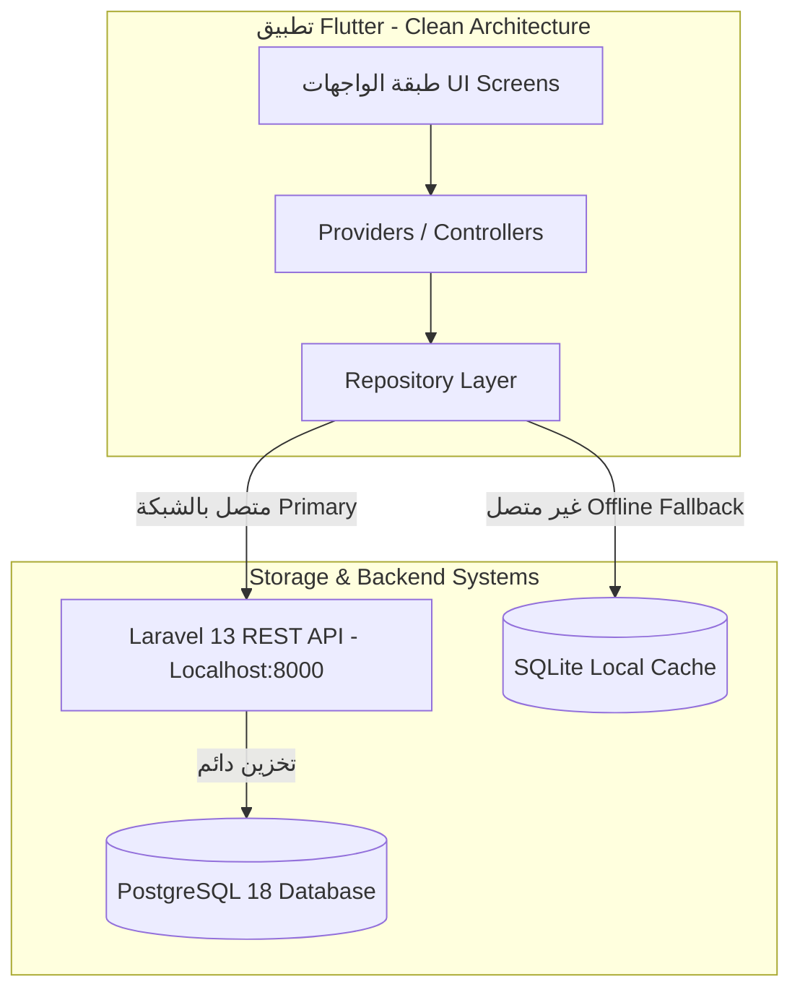
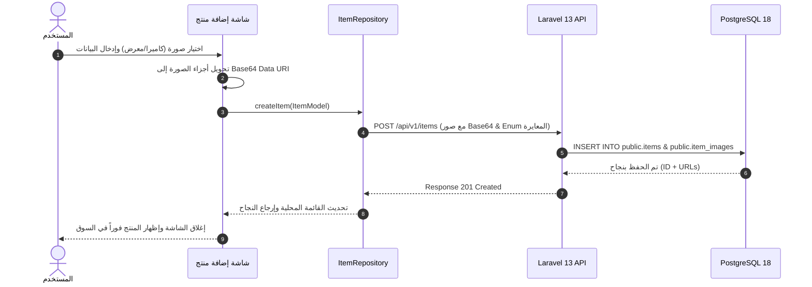
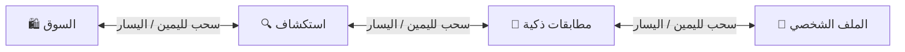
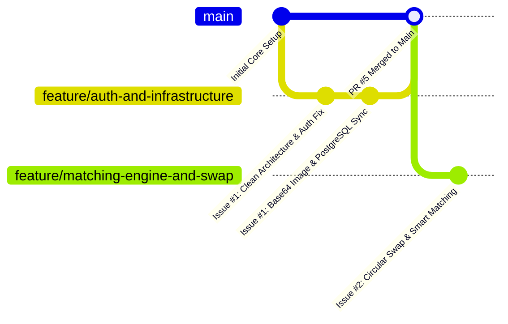

# 📱 منصة بدلها (BADELHA) - دليل الواجهات والمعمارية الفنية والمخططات

---

## 📑 جدول المحتويات
1. [نظرة عامة ومعمارية النظام](#1-نظرة-عامة-ومعمارية-النظام)
2. [المخططات التوضيحية وتدفق البيانات (Mermaid Diagrams)](#2-المخططات-التوضيحية-وتدفق-البيانات)
3. [دليل الواجهات والشاشات التفصيلي (UI Specifications)](#3-دليل-الواجهات-والشاشات-التفصيلي)
4. [معالجة الصور والربط مع PostgreSQL](#4-معالجة-الصور-والربط-مع-postgresql)
5. [توزيع العمل والأنشطة للفريق على GitHub](#5-توزيع-العمل-والأنشطة-للفريق-على-github)

---

## 1. نظرة عامة ومعمارية النظام

منصة **بَدِّلْهَا (BADELHA)** هي تطبيق مقايضة ذكي وتبادل مباشر ودائري للسلع، مبني وفق معمارية النطاق النظيف (**Clean Architecture**).

### 🏗️ معمارية التخزين المزدوج (Hybrid Dual-Storage):
- **المصدر المركزي للحقيقة (Source of Truth):** قاعدة بيانات **PostgreSQL 18** عبر واجهات برمجية **Laravel 13 REST API**.
- **التخزين المحلي المؤقت (Local Offline Cache):** قاعدة بيانات **SQLite** محلياً لضمان سرعة الاستجابة وعمل التطبيق دون اتصال.

---

## 2. المخططات التوضيحية وتدفق البيانات

### 🔄 مخطط تدفق إضافة منتج جديد وحفظ الصور (Add Item Lifecycle)

### 👆 مخطط التنقل بالسحب بين التبويبات (Swipeable PageView Navigation)

---

## 3. دليل الواجهات والشاشات التفصيلي

### 🛍️ 1. شاشة السوق المباشر (Marketplace Screen)
* **تخطيط الشبكة (Grid Layout):** شبكة مرنة من عمودين (`GridView.builder` بـ `crossAxisCount: 2` ونسبة أبعاد `childAspectRatio: 0.74`).
* **مكونات بطاقة المنتج (`ItemCard`):**
  - **حاوية الصورة:** ارتفاع محدد (98px) مع زوايا دائرية ودعم فك ترميز Base64 و Network و File.
  - **شارات الثقة والحالة:** شارة التقييم ⭐ (`Trust Score`) وشارة حالة المنتج (جديد، كالجديد، ممتاز، جيد).
  - **زر المفضلة:** أيقونة التفضيل التفاعلية ❤️ مع تأثيرات تحويم دائرية.
  - **شريحة المقايضة Target Pill:** شريحة أنيقة أسفل البطاقة تبيّن السلعة المطلوبة للمقايضة (`يريد: آيفون / لاب توب`).

### 🔍 2. شاشة الاستكشاف (Explore Screen)
* **الأقسام التصنيفية:** الأجهزة الإلكترونية، السيارات، الأثاث، المستلزمات الشخصية.
* **البحث والتصفية:** شريط بحث سريع للفلترة الذكية حسب الموقع والتقييم وطلب المقايضة.

### 🎯 3. شاشة المقايضات الذكية (Smart Matches Screen)
* **المطابقة المباشرة:** حساب نسبة التوافق % بين ما تملكه وما يطلبه المستخدم الآخر.
* **المقايضة الدائرية (Circular Swap):** اقتراح تبادل ثلاثي بين (أ -> ب -> ج -> أ) لحل مشكلة عدم المطابقة المباشرة.

### 👆 4. شريط التنقل السلس (Swipeable Bottom Navigation Bar)
* تم دمج `PageView` و `PageController` مع فيزياء سحب مرنة `BouncingScrollPhysics`.
* يتيح للمستخدم الانتقال بين التبويبات السفلية بسهولة عن طريق اللمس وسحب الشاشة يميناً ويساراً دون الحاجة للنقر على الأيقونات فقط.

---

## 4. معالجة الصور والربط مع PostgreSQL

### 🛠️ حل مشكلة عدم ظهور الصور وقاعدة البيانات:
1. **ترميز الصور:** يتم تحويل الصورة الملتقطة من الكاميرا أو المعرض إلى نص ترميزي `data:image/jpeg;base64,...`.
2. **مطابقة Enums قاعدة البيانات:**
   - **الحالة (`condition`):** تحويل النصوص العربية تلقائياً إلى القيم المقبولة في PostgreSQL (`new`, `like_new`, `excellent`, `good`, `fair`).
   - **نوع المقايضة (`swap_type`):** تحويل النص إلى (`exact_match`, `cash_adjustment`, `any`).
3. **الجداول المستهدفة في pgAdmin 4:**
   - جدول المنتجات الرئيسي: `public.items`
   - جدول صور المنتجات: `public.item_images`

---

## 5. توزيع العمل والأنشطة للفريق على GitHub

تم تقسيم المشروع إلى قضيتين (**2 Issues**) ومتابعتهما عبر GitHub:

| رقم القضية | اسم المهمة والمسؤول | الفرع | الحالة |
| :--- | :--- | :--- | :--- |
| **Issue #1** | **البنية التحتية والمصادقة والربط** 👤 عبدالرحمن اليفرسي (`abdulrrhman-alyafrasi-dev`) | `feature/auth-and-infrastructure` | 🟢 مكتمل ومرفوع (PR #5) |
| **Issue #2** | **محرك المطابقة والمقايضة الدائرية** 👤 سلطان العمراني (`Sultan-Al-Amrani`) | `feature/matching-engine-and-swap` | 🟡 جاري التنفيذ والمراجعة |

---
*تم تحديث هذا الدليل بواسطة فريق الهندسة وتطوير النظم للمشروع.*
